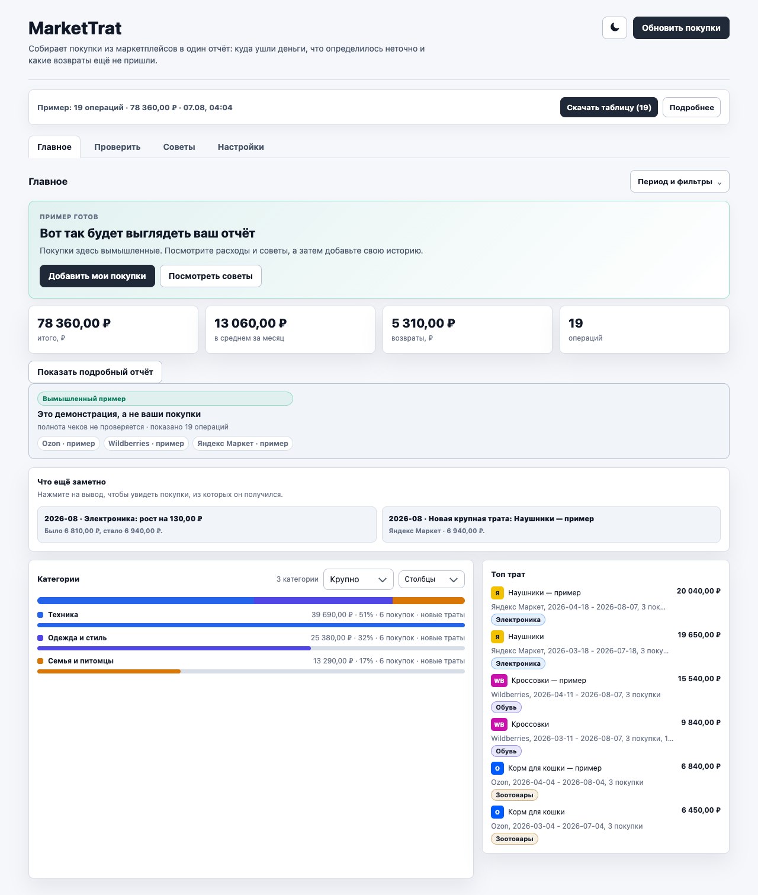
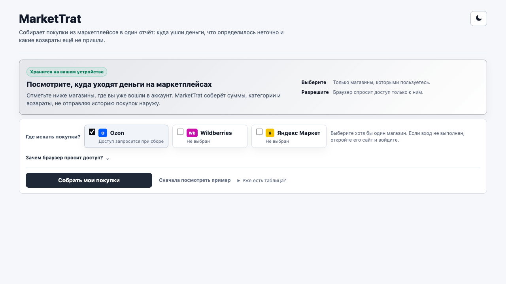

<p align="center">
  
</p>

# Куплено

Покупки и возвраты с Ozon, Wildberries и Яндекс Маркета — в одном понятном отчёте. Без аккаунта, облака и отправки истории покупок наружу.

[Скачать последнюю версию](https://github.com/malyarq/kupleno/releases/latest) · [Как установить](#установка) · [Документация](docs/README.md) · [Помощь](SUPPORT.md)

[](https://github.com/malyarq/kupleno/actions/workflows/verify-release.yml)
[](https://github.com/malyarq/kupleno/actions/workflows/codeql.yml)
[](https://github.com/malyarq/kupleno/releases/latest)
[](LICENSE)

Текущая версия исходников: `0.19.2`. Последний опубликованный релиз: `0.18.2`.



## Зачем

Маркетплейсы показывают заказы по отдельности. Куплено собирает общую картину и отвечает на простые вопросы: сколько потрачено, сколько вернулось, куда ушли деньги и что выглядит необычно.

| Что нужно | Что делает Куплено |
| --- | --- |
| Увидеть общую сумму | Объединяет покупки и возвраты трёх маркетплейсов |
| Не считать доставку дважды | Сопоставляет ранние и итоговые чеки, учитывает сервисные сборы |
| Понять структуру расходов | Показывает динамику, категории и самые крупные покупки сразу |
| Найти сомнительные операции | Отдельно предлагает проверить возможные повторы, скачки цены и возвраты |
| Сохранить контроль над данными | Хранит историю, правила и резервные копии только в браузере |
| Продолжить анализ самому | Выгружает CSV и JSON для таблиц или личного бюджета |

## Как это выглядит



1. Выберите магазины, где уже вошли в аккаунт.
2. Нажмите `Собрать покупки` и разрешите доступ только к выбранным сайтам.
3. Смотрите итог, график и категории. Если что-то действительно требует внимания, Куплено вынесет это в раздел `Проверить`.

Можно сначала открыть безопасный пример: он не сохраняется и не смешивается с вашей историей.

## Возможности

- Ozon, Wildberries и Яндекс Маркет в одном отчёте;
- покупки, возвраты, доставка и сервисные сборы без двойного учёта известных пар чеков;
- динамика по дням, неделям, месяцам и годам;
- понятные крупные категории и подробная расшифровка;
- локальные правила категорий с объяснением совпадения;
- профили, заметки, ручные исправления и массовые действия;
- проверка возможных дублей, изменений цены и несопоставленных возвратов;
- ожидаемые возвраты, гарантии, бюджеты и закрытие месяца;
- резервная копия, полный JSON и несколько вариантов CSV;
- локальные снимки базы для восстановления после ошибки;
- светлая и тёмная темы, клавиатурная навигация и мобильная компоновка.

## Установка

> Куплено пока ставится как распакованное расширение. Это ограничение способа распространения, а не платная регистрация: аккаунт в самом продукте не нужен.

1. Скачайте `kupleno-extension.zip` из [последнего GitHub Release](https://github.com/malyarq/kupleno/releases/latest).
2. Распакуйте архив в постоянную папку.
3. Откройте `chrome://extensions` в Chrome, Edge или Яндекс Браузере.
4. Включите `Режим разработчика`.
5. Нажмите `Загрузить распакованное расширение` и выберите папку с `manifest.json`.
6. Закрепите иконку Куплено на панели браузера.

Не используйте `Source code (zip)` от GitHub: это исходники, а не проверенный архив расширения.

## Обновление

Распакованные расширения не обновляются автоматически. Куплено само проверяет номер последнего публичного релиза и показывает ссылку, когда доступна новая версия.

Чтобы сохранить тот же ID и локальную базу:

1. скачайте резервную копию в `Настройки → Резервная копия`;
2. скачайте новый `kupleno-extension.zip`;
3. замените содержимое старой папки расширения файлами из нового архива;
4. нажмите обновление на странице `chrome://extensions`.

Не подключайте новую папку как вторую копию расширения: браузер может создать другой ID. Полная инструкция и откат описаны в [правилах совместимости](docs/DATA_AND_COMPATIBILITY.md).

## Приватность

- История покупок, профили, категории, бюджеты и заметки хранятся локально.
- Куплено обращается только к выбранным маркетплейсам во время сбора и к GitHub для проверки номера релиза.
- Доступ к сайтам запрашивается по необходимости и отзывается в `Настройки`.
- Cookie нужен только для чтения сессии Wildberries; пароли расширение не читает.
- Внешний ИИ, аналитика поведения и рекламные трекеры не используются.

Подробнее: [политика конфиденциальности](PRIVACY.md) и [модель безопасности](SECURITY.md).

## Честные ограничения

- Маркетплейсы могут менять страницы и внутренние API. Если часть истории не получена, Куплено помечает отчёт как неполный.
- Полноту импортированного CSV доказать нельзя: расширение честно сообщает об этом.
- Ozon PDF разбирается только при наличии текстового слоя.
- Категории определяются локальными правилами. Это полезная классификация, а не обещание стопроцентной точности.
- Возможные дубли и история цены — подсказки. Окончательное решение принимает пользователь.
- Для проверки живого сбора нужен браузерный профиль с выполненным входом; CI не содержит пользовательских сессий.

## Разработка

Нужны Node.js 20+ и Chromium для Playwright.

```bash
npm ci
npx playwright install chromium
npm run verify
npm run verify:reproducible
```

`npm run verify` проверяет модули, эталон категорий, документацию, безопасность, производительность, точный ZIP и пользовательские сценарии в настоящем Chromium. Выпуск из чистого аннотированного тега дополнительно проверяется командой:

```bash
npm run verify:release -- v0.19.2
```

Состав и правила проекта: [архитектура](docs/ARCHITECTURE.md), [тестирование](docs/TESTING.md), [сопровождение](docs/MAINTENANCE.md), [выпуск](RELEASE.md), [участие](CONTRIBUTING.md).

## Статус

Куплено — локальный проект с публичными воспроизводимыми релизами. Код, хранилища, резервные копии, архивы и публичные материалы используют единое имя `Куплено` / `kupleno`.

## Лицензия

MIT. Встроенный PDF.js распространяется по Apache-2.0; точные версии и хеши указаны в [THIRD_PARTY_NOTICES.md](THIRD_PARTY_NOTICES.md).
